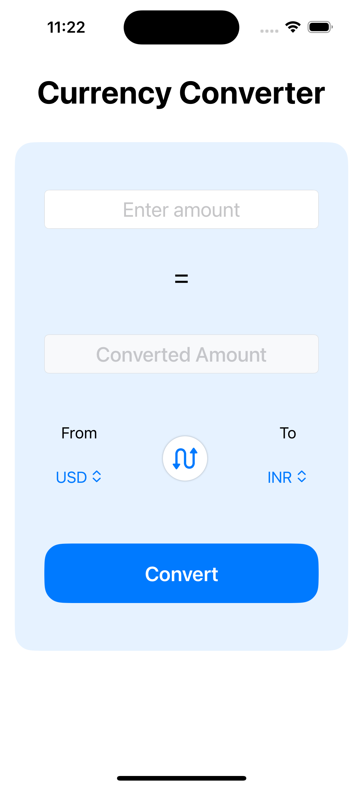
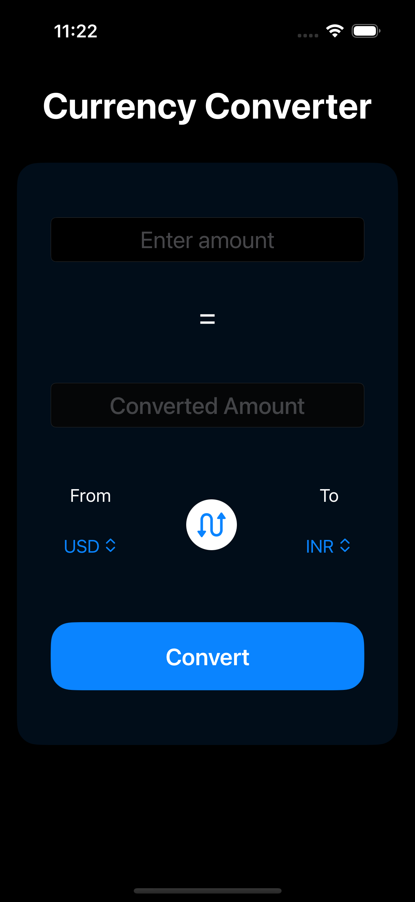

# Currency Converter App

A SwiftUI-based currency converter application with MVVM architecture, dependency injection, unit testing, and Core Data caching for offline support.

## Features

-  **Real-time currency conversion** using an API
-  **Swap functionality** to quickly switch between currencies
-  **Core Data caching** for offline support
-  **Unit tests** for key functionalities
-  **User-friendly UI** with dark mode support
-  **Dependency Injection** for better testability and modularity

---

##  How to Run the Project

1. **Clone the repository**
   ```sh
   git clone https://github.com/your-repo/currency-converter.git
   cd currency-converter
   ```
2. **Open in Xcode** (latest version recommended).
3. **Ensure you have an active internet connection** for live exchange rates.
4. **Select a Simulator or Physical Device**.
5. **Run the project**
   ```sh
   Cmd + R
   ```

---

##  Assumptions Made

- Default currencies: **USD (from) → INR (to)**
- Exchange rate **caching enabled** using  **Core Data** for offline mode
- **Swap button** allows quick reversal of currency selection
- **Error handling** for failed API calls
- Designed a **simple and user-friendly UI**, ensuring ease of use.

---

##  Challenges Faced & Solutions


###  Offline Mode Support
- **Issue:** No internet connectivity affects usability
- **Solution:** Used **Core Data** to cache exchange rates

###  UI Responsiveness
- **Issue:** Ensuring usability across different screen sizes
- **Solution:** SwiftUI’s **Adaptive Layouts** and testing on multiple devices

###  Unit Testing & Modularity
- **Issue:** Maintaining testability of components
- **Solution:** Used **Dependency Injection** to improve modularity

---

## 🎯 Future Improvements

-  **Historical Data & Charts** for exchange rate trends
-  **Multi-language support**
-  **Performance optimizations** for smoother UI transitions

---

## 📸 UI Preview




